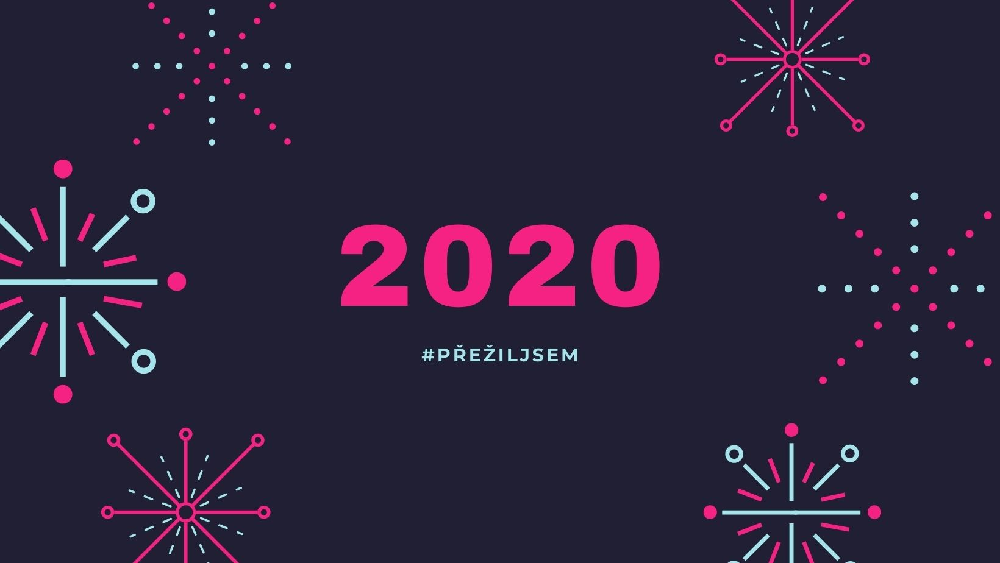
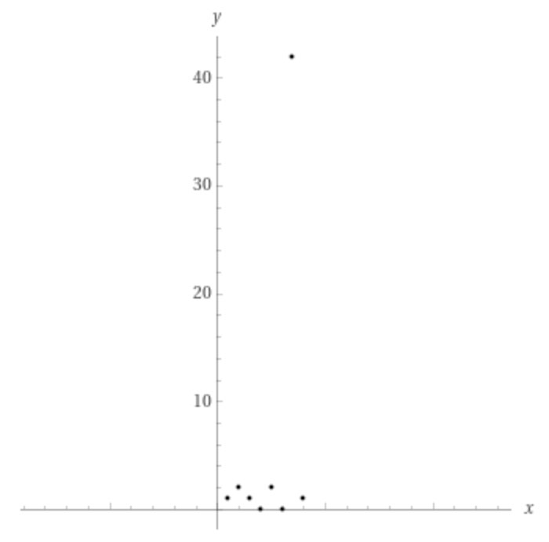

Rok 2020 už je pár týdnu historií a abych letos vykopnul své psaní, vrátím se k pár věcem, které jsem si z loňska odnesl. Než psát články tipu "10 zaručených tipů jak ..." se rozepíšu o třech rčeních a jejich významech (pro mě) vzhledem k roku 2020.

## 1. Pravda je někde uprostřed.

Nejsilnější výhodou sociálních sítí a zároveň i nevýhodou je, že každý má prostor ventilovat svůj názor. Můžeme se smát nad tím, že v České Republice je během MS v hokeji najednou 10 milionů hokejových trenéru. Když se ale jedná o sebezvané experty na pandemii nebo očkování, přestává zábava a smích přechází v pláč. [Nejedna studie][guardian] poukazuje na jev, kdy nárůst uživatelů sociálních sítí koreluje s nárůstem lidí věřících v různé bludy. Ať už se jedná o placatou zem nebo stoupence Lucifera v politice Spojených států amerických, stejně tak během různých fází pandemie začali lidi věřit kdejakým báchorkám kolem onemocnění covid-19.

Jak zde figuruje "pravda je někde uprostřed"? Pojďme si vytvořit fiktivní příběh.

### Honzík a jeho zlámané nohy

- Chlapec Honzík spadne na koloběžce a odře si kolena. Tatínek je u celého incidentu fyzicky přítomný, duchem nikoliv.
- Tatínek Honzíka mlží a říká mamince do telefonu, že se vlastně nic nestalo. Honzík na pozadí brečí jak když ho na nože berou.
- Maminka volá babičce a říká, že Honzík spadl a poranil si obě kolena. Prý u toho šíleně řval.
- Babička přehání a řekne dědovi, že Honzík si zlámal obě nohy na koloběžce.

Děda bere osud do vlastních rukou a volá tatínkovi. V tuto chvíli má k dispozici dvě zprávy o situaci, které jsou v přímem konfliktu:
1. Nic se nestalo.
2. Honzík má zlomené obě nohy.

Pakliže si řekneme, že význam "pravda je někde uprostřed" je "sečtu obojí a vydělím dvěma":

> ![\Large \frac{0n&plus;2n}{2}=1n][leg-formula]

Dostaneme se k závěru neslučujícím se s realitou - zlomil si *právě jednu nohu*.

### Definice děleného prostoru

Jev, který jsem se počtem zlomených nohou snažil demonstrovat se v datové analýze nazývá [*outlier*][outlier] - tedy nějaká hodnota, která se naprosto vymyká distribuci ostatních hodnot v dané množině.

> ![\Large x\in{1,2,1,0,2,0,42,1}][outlier-formula]

Hodnota *42* je outlier - naše množina jsou hodnoty v rozmezí 0 až 2 a hodnota 42 nám tam nezapadá. Proč nezapadá?

1. Modus množiny je roven **1**
2. Medián množiny je roven **1**
3. Průměr množiny je **6.25**

Jelikož žádná z hodnot (= realita) nenabývá hodnoty blízké šesti, můžeme usoudit, že průměr množiny je nám statisticky úplně k ničemu a musíme pátrat jinde - *hledat outlier*.

Pojďme si ještě pro ilustraci črtnout hodnoty množiny do grafu:

Hodnotu 42 si můžeme představit, jako informaci o zlámaných nohou Honzíka. Hodnoty 0-2 ve spodní části grafu jsou pak mantinely mezi kterými se pohybuje ta *reálná* průměrná hodnota, kde můžeme s klidem říct, že "pravda je někde uprostřed".

### Oddělení plevele od stébla

Jistě, výhodou našeho fiktivního příběhu je to, že je *evidentní*, jaká je realita. Není ale důvod k panice - ačkoliv je svět složitější, než příklady [z učebnice od Petákové][petakova], stejně tak se dá naučit rozpoznat nesmysly a bláboly a najít kompromis, který je *doopravdy uprostřed* spektra smysluplných hodnot.

Jak na to? Pojďme se podívat na příčiny informačního šumu:

1. Realita kolem Honzíka byla z výpovědí pokřivená, neboť samotné výroky zúčastněných byly nepravdivé. Takový fenomén můžeme vypozorovat v poplašných zprávách, tedy hoaxu, dnes spíše nazývanými "fake news". Nevěrohodná stránka vypublikuje článek s poplašnou zprávou a sociálními sítěmi se to začne šířit jak mor. V takovém případě doporučuji použít [Occamovu břitvu][occam] - jakmile zavání zpráva konspirační teorií s muži v černém, hledejte v informaci vyplašenou babičku a zlámané nohy.
2. Outlier v množině čísel je pouze jeden z mnoha. Pravděpodobnost výskytu hodnoty 42 je **12.5%**. Takový fenomén můžeme vypozorovat u dalších poplašných zpráv, kde se vyskytnul jev, jehož opakovaná přítomnost je vysoce nepravděpodobná. V takovém případě je třeba se dívat na celý obrázek a ptát se - je opravdu možné, že se něco takového stane? A jak moc?

Nejdůležitější ingrediencí pro nacvičení rozpoznávání blbostí je informační dieta. Koneckonců, sociální sítě amplifikují přenos falešných zpráv a proto je třeba si vytvořit disciplínu a netrávit na sociálních sítích příliš času. Nebudu se pouštět do vysvětlování proč - od toho má můj bývalý šéf, [Pepa Holý][holy-josef], podcast, který [vřele doporučuju][kanarci].

Můj přístup k sociálním sítím:
1. Instagram - privátní účet, aktivně nepoužívám.
2. Facebook - zrušené sledování všech kromě rodiny a blízkých přátel. Aktivita jednou denně.
3. LinkedIn - pouze online CV, žádná timeline a sdílení obsahu. Aktivita jednou-dvakrát do měsíce.
4. Twitter - Pasivní aktivita cca jednou týdně.

Za žádných okolností nemám tyto služby nainstalované na telefonu. Telefon je na telefonování, nikoliv na konzumaci zpráv.

Další důležitý prvek pro nacvičení filtru je čtení kvalitních zdrojů, maximálně jednou za týden. Už i nezávislá média, jako je anglický Guardian, podlehla fenoménu clickbaitů a zobrazují zavádějící titulky s blikajícími obrázky, stimulující náš plazí mozek a nikoliv neocortex. Doporučuji si vybrat 2-3 **kvalitní nezávislé** stránky, ideálně po ose ČR - Evropa - USA a zaručeně si po pár měsících uděláte obrázek o tom, co je pravda a co jen kecy v kleci.

## 2. Co můžeš udělat dnes, neodkládej na zítřek.

Stejně jako předchozí rčení i toto obrátíme trochu naruby. Pokud hledáte dávku motivace a návod na ultraproduktivní den, chyba lávky. Díky dlouhému času strávenému doma jsem měl tu možnost přečíst spoustu knížek. Jedna z nich, která mě pozitivně ovlivnila byla ["Essentialism"][essential] od Grega McKeowna.

### Co můžeš *ale nemusíš* udělat dnes ...

Co je opravdu důležité vykonávat na denní bázi (bez evidentních aktivit jako hygiena, stravování se aj.)? Které činnosti v práci *opravdu* musíte udělat a které děláte proto, že cítíte tlak okolí/kolegů? Opravdu je trávení času na výše zmíněných sociálních sítích důležitější, než čtení intelektuálně stimulující knížky? Dost otázek, čas na odpověď, kterou využíváme méně, než je zdrávo.

> Ne.

A to je konec věty. Prostě ne.

- "Máš čas na rychlej call na Zoomu?" Ne.
- "Nemohl bys ještě před deadlinem rychle nahodit tuhle extra stránku?" Ne.
- "Nechceš si bokem trochu přivydělat? Mám supr nápad na projekt!" Ne.

Ne, ne a ne. Všichni máme stejný počet hodin v jednom dni. Jestliže si sám nenastavím priority v mém kalendáři, někdo jiný to udělá za mě.

### ... neodkládej na zítřek, *ale na nikdy*

Na první pokus to bude nepříjemný. Kolegové budou zklamaní, někteří přátelé vám to možná budou chvíli vyčítat, ale ve finále budete mít mnohem větší respekt. To proto, že si vážíte svýho času a proto si času s vámi budou vážit jiní o to víc.

"Co když ale bude tenhle projekt příležitost?"...a co když nebude? Kdo mi vrátí můj čas? Mám na talíři už dost na to, abych věděl, že kterákoliv další aktivita, která je prioritou někoho jiného, bude u mě možná na sedmém až osmém místě. Drtivou většinu nabídek předem odmítám - jakmile nemám na první pohled zájem, pravděpodobnost, že detaily něco zlepší, je mizivá. Na odmítání mám už i předpřipravené šablony, které pouze rozkopíruju do odpovědi pomocí nástroje [Alfred][alfred]. Když ale někdo přijde s opravdu zajímavou nabídkou, postavím ho před tvrdou realitu:

> Na váš projekt X si můžu udělat čas jednou za týden/měsíc na jednu/dvě hodiny. Sazba je Y EUR/h.

Polovina lidí ani neodpoví, 49% pěkně poděkuje a odmítne a to zbylé 1% je esenciální aktivita, kterou jsem ochoten dát do svého kalendáře. Podle pravidel, které jsem předem stanovil. Zatím na ně přistoupili všichni zúčastnění.

## 3. Co Tě nezabije to Tě posílí.

Po předchozích dvou příspěvcích bych zřejmě měl dodržet tempo a opět to rčení obrátit naruby. Kdepak. Letošní pandemie je, troufám si tvrdit, "2. světová válka" naší generace. Civilizace se bude z jejích následků vzpamatovávat minimálně 5 let, ne-li víc. Možná nejhorší na tom všem je, že se obracíme proti sobě:

- nosí/nenosí roušku
- chodí/nechodí na domácí párty
- chce/nechce vakcinaci

Přitom bojujeme proti společnému nepříteli - neviditelnému viru. Španělská chřipka trvala dva roky a přešla. I tohle přejde, ale musíme proti tomu bojovat **společně**. Není čas na hrdinství, zůstaňme doma a vyčkejme na vakcínu. Konec tunelu se už blíží a já vidím světlo.

V roce 2020 jsem ...

1. musel odložit svatbu.
2. nemohl za rodinou do ČR a v GB.
3. nemohl na konference, protože byly všechny zrušené.
4. nesměl pořádat [meetupy][meetup].
5. nemohl provozovat hudbu s orchestrem.

Ale ani jedna z těchto (a jiných) nepříjmeností mě nezabila. Právě naopak.

V roce 2020 jsem ...

1. upekl svůj první dort i chleba.
2. uvedl v život po půl roce tvrdé práce zatím [největší projekt][backbone], na kterým jsem kdy pracoval.
3. přečetl 16 knih (a konečně dočetl jednu, [kterou jsem rozečetl v roce 2010][everybody]).
4. pospravil všechno doma, co jsem roky odkládal.
5. připravil komplet štědrovečerní večeři.

A přesně tento narativ se snažím v sobě držet, protože z negativního myšlení nic pozitivního nevznikne. Od prvního lockdownu si udržuju průběžně "kapitánův deník", který mi pomáhá rozeznávat splývající dny, týdny a měsíce. Když v něm zalistuju, nevidím v něm "počet nakažených", "zavřené hranice", ale drobné výhry jako "nastavit mamce G Suite", "zaškolit novýho kolegu" nebo "naložit utopence". Na úhlu pohledu opravdu záleží.

Takže na pozitivních vlnách a za zvuku Kelly Clarkson nashle příště! 👋

  <iframe
    class="iframe-responsive"
    title="What doesn't kill you makes you stronger."
    src="https://www.youtube.com/embed/Xn676-fLq7I"
    frameborder="0"
    allow="accelerometer; autoplay; encrypted-media; gyroscope; picture-in-picture"
    allowFullscreen
  />

[guardian]: https://www.theguardian.com/science/2019/feb/17/study-blames-youtube-for-rise-in-number-of-flat-earthers
[leg-formula]: https://latex.codecogs.com/svg.latex?\Large&space;\frac{0n&plus;2n}{2}=1n
[outlier]: https://en.wikipedia.org/wiki/Outlier
[outlier-formula]: https://latex.codecogs.com/svg.latex?\Large&space;x\in{1,2,1,0,2,0,42,1}
[petakova]: https://prometheus-nakl.cz/index.php?zobraz=detail&id_katalog=170
[occam]: https://cs.wikipedia.org/wiki/Occamova_břitva
[holy-josef]: https://twitter.com/holyj?lang=gl
[kanarci]: https://www.kanarci.online
[essential]: https://www.goodreads.com/book/show/18077875-essentialism
[alfred]: https://www.alfredapp.com
[meetup]: https://devc.ch
[backbone]: https://app.bkbn.com
[everybody]: https://www.goodreads.com/book/show/6056420-here-comes-everybody