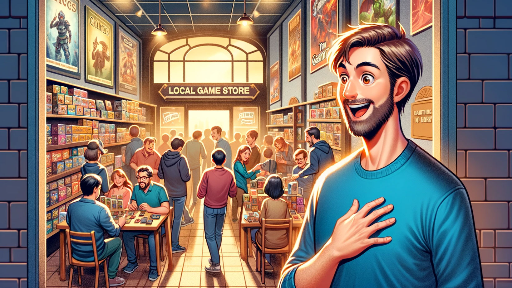
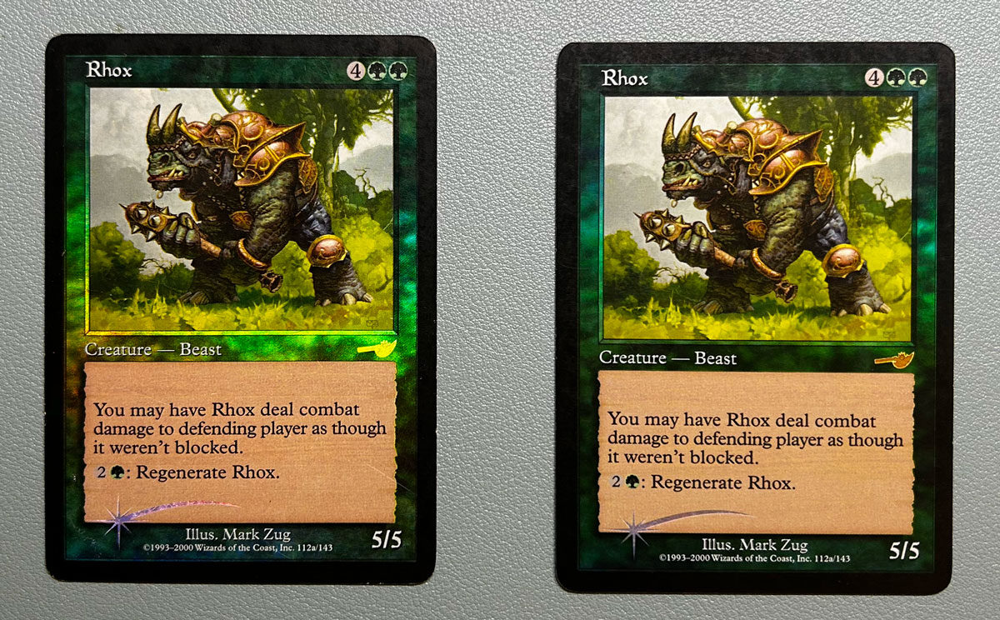
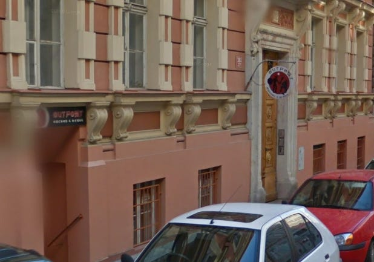
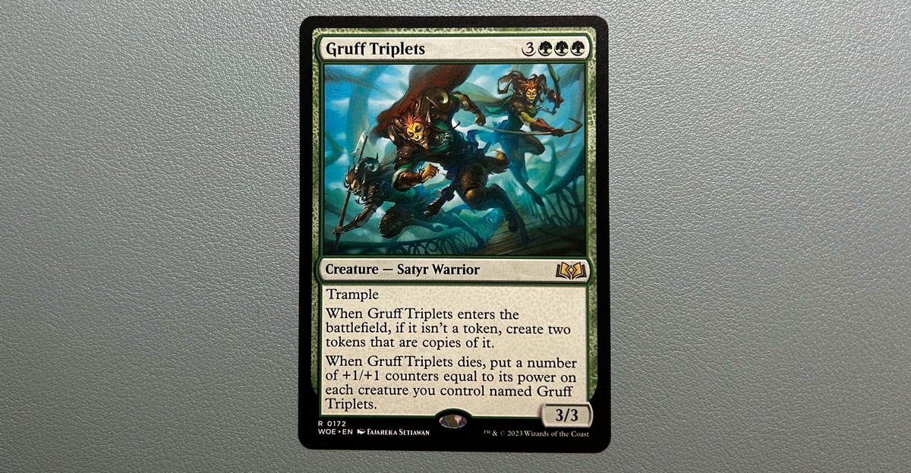

> **Poznámka**: Tento článek byl původně publikován na [Mana Outpost][mana-outpost]. Zde jej sdílím pro širší dostupnost.

## Návrat ke kořenům

Moje cesta karetní hrou Magic the Gathering začala v roce 2000, konkrétně na únorové oslavě narozenin mého kamaráda Pavla. Pavel tenkrát dostal jako dárek od taťky booster edice [Portal Second Age][portal-second-age]. Doteď si pamatuju, jak Pavel musel dárek "najít". Jeho táta měl booster schovaný v náprsní kapse košile a hrál s Pavlem "samá voda/přihořívá". Koukal jsem jak puk, když booster otevíral. Netušil jsem, co to je, ale [ilustrace][portal-art] mě okamžitě zaujaly.

Můj vlastní vstup do tohoto světa byl pečlivě načasován s koncem školního roku, kdy jsem jako odměnu za vysvědčení dostal [Starter 2000][starter-2000]. Byla to sada plná (na první pohled malýho kluka) vzrušujících karet, včetně foilového Rhoxe z edice Nemesis a dalších kousků ze 6. edice. Tyto karty nejen že znamenaly začátek mého dobrodružství v Magic, ale staly se i základem mé první sbírky.

Po pár letech hraní ve škole jsme se s Pavlem poprvé vypravili na turnaj pro začátečníky v herně [Outpost][outpost-article]. V té době jsem hrál balík Mono Green Madness. Tyto víkendové turnaje byly neformální, plné hráčů jako jsem byl já - začátečníků bez silných balíčků, ale s o to větší chutí do hry. Bylo to něco jako formát Extended, ale bez výrazných omezení, což nám dávalo prostor experimentovat a učit se, bez nutnosti mít ty nejlepší (a nejdražší) karty.

  Outpost herna v Kroftově ulici (Street view ze srpna 2011)

V roce 2009 jsem hru opustil kvůli blížící se maturitě a následnému studiu na vysoké škole. Loni se nám narodila dcera a kombinace únavy z hraní her pouze u obrazovky a chutí jít občas mezi lidi (bez alkoholu) mě zavedla zpátky do známých alejí - deskovky a pak i Magicy. 

Za těch 14 let se ale změnilo v podstatě úplně všechno a rád bych tímto nabídnul vám, čtenářům, unikátní pohled na hru jako takovou. Nostalgické vzpomínky na hernu Outpost, která už je dnes bohužel zavřená, se snoubí s překvapením, které jsem zažil po návratu k hře - [pravidlo "mana burn" už neplatí][mana-burn]. Toto spojení starých vzpomínek a nových pravidel bylo inspirací pro název blogu (na kterém byl příspěvek původně publikován - pozn. autora) - Mana Outpost.

## 14 let je dlouhá doba

Po dlouhé herní pauze jsem se vrátil ke hře, která prošla řadou změn. Můj první krok - účast na draftu ([Wilds of Eldraine][woe]) na Friday Night Magic (FNM) - byla první příležitostí setkat se s těmito změnami. S posledním otevřeným boosterem [Alara Reborn][alara] jsem si uvědomil, že mám před sebou nemalou výzvu dohnat zameškané.

  Poslední booster co jsem si koupil v Rytířovi před pauzou.

První věc, kterou jsem konečně po letech pochopil, je definice ["spellu"][spell]. Spell totiž, světe div se, zahrnuje jakoukoliv kartu, kterou vyvolávám pomocí many, nikoliv pouze "Sorcery" a "Instant". Lepší pozdě než nikdy, ale i tak jsem se trochu zastyděl.

Významný rozdíl oproti mým skromným začátkům byla záplava [klíčových slov][keywords] bez vysvětlujícího textu (!!!) jako ["Exile"][exile], ["Mill"][mill], ["Scry"][scry], ["Defender"][defender], ["Deathtouch"][deathtouch], ["Double strike"][double-strike] a nebo ["Flash"][flash]. Než jsem šel na draft, strávil jsem hodinu studováním klíčových slov a porovnáváním s podobnými mechanikami v jiných hrách, jako je třeba Hearthstone (např. Deathtouch je totéž co Poisonous apod).

Další překvapení byly nové typy karet, jako jsou [sagy][saga], [planeswalkeři][planeswalker] a [plane karty][plane], nicméně nejvíc mě vystřelila z pantoflů masivní přehršel tokenů. Ať už to byly artefakty typu food, treasure nebo clue. Hlavně ve WOE každá druhá karta přiřazuje nějakou [roli][role] (young hero, wicked, monster…) a to přidávalo do hry úplně nové možnosti a strategie.

Nejpozitivnější změny pro mě ovšem bylo odstranění pravidla "mana burn" a zavedení nového formátu [mulliganu][mulligan], který je přívětivější než starý systém. Když si mohu znovu nalízat sedm karet a z nich si vybrat optimálních šest, nedejbože pět, nejsem tolik potrestán, jako kdybych si líznul šest, resp. pět a karta, která by rozhodla, zda si ponechám ruku, byla sedmá, potažmo šestá a sedmá. Takhle si nechám to, co chci, mám o kartu méně, ale alespoň nejsem tolik trestán nahodilostí karet.

Možná vás zajímá, jak ten draft dopadl. Nebylo to tak špatné, skončil jsem třetí ze šesti u stolu. A to jsem, prosím, v prvním boosteru pustil kolegovi vedle Gruff Triplets, protože jsem si říkal: "Bože, to je drahý, tak dlouho se hra přece nepotáhne." Když jsem trojčata v draftu o týden později otevřel znovu, už jsem si je nechal. A draft mi vyhrály. Podle DraftSim to je [nejsilnější karta edice][draftsim]. No, s takovou kartou se to pak hraje, že ano.

## Digitální a papírový svět

V roce 2014 jsem objevil Hearthstone (HS), což mi připomnělo časy s MTG. Hrál jsem HS až do roku 2020, kdy jsem se rozhodl opustit constructed formát. Přistihl jsem se, že mě nebaví otevírat packy z předobjednaného [Darkmoon Faire][darkmoon], což mě přimělo k zamyšlení nad efektivitou mých investic do hry. Přesto jsem se za tu dobu s Hearthstone ztotožnil stejně, jako dříve s Magicy.

Zajímavým aspektem HS je jeho design jako čistě digitální hry. Interakce a mechaniky, které jsou v HS běžné, jsou ve fyzické hře jako MTG nepředstavitelné. Příklady jako [spálení všech karet dražších než 3 many][hemet] nebo [kopírování karet v ruce][copy] dokazují, že i karetní hra může existovat v digitálním světě. Na druhou stranu, [MTG Arena][arena] připomíná pokus o adaptaci tradiční stolní hry do digitálního formátu, kde některé mechaniky, jako je [stack][stack], působí nepřirozeně.

Výhodou digitální hry je zjednodušení administrativních aspektů, což umožňuje hráčům soustředit se na strategii. Trackování počtu životů, karet v ruce, nebo automatické navyšování síly potvor přenechává HS hře, což zjednodušuje hraní. Nepřijde mi adekvátní v roce 2024 hrát na "to je jedno, že se ti měla potvora automaticky zvětšit, je to zahraný!". S narůstající složitostí karet a mechanik je trestání hráče za zapomenutí automatického zvýšení počtu counterů zbytečné a vlastně úplně mimo mísu.

  A jak trackujete čísla v analogovém světě vy?

Dalším plusem HS je snadné a rychlé hledání protihráčů na podobné úrovni, což umožňuje intenzivní trénink balíku proti široké škále soupeřů. Líbil se mi také [systém disenchantování karet pro získání zdrojů na vycraftování nových][crafting]. Nicméně, politika Blizzardu, zejména zavedení [Runestone][runestone] měny, mi přišla problematická. Tento krok ztěžuje přehled o finanční investici do hry. Rovněž kvalita obsahu v HS začala klesat, jak ukazuje rozdíl mezi trailerem pro [Scholomance Academy][scholomance] oproti odfláknuté prezentaci [Titans][titans].

Nejvýraznějším rozdílem pro mě ale byla sociální interakce. V HS mi chyběla možnost diskutovat s protihráčem po hře, což je něco, co digitální chat nemůže plně nahradit. Tento nedostatek sociální interakce mě nakonec přivedl zpět k MTG. Možnost setkat se s lidmi, diskutovat o hře, učit se od sebe a smát se příšerným misplays při dalších FNM, to vše pro mě představuje esenci stolních her jako je právě MTG (tedy v papírové podobě). Proto jsem se ke hře vrátil. A HS? Už jenom [Battlegrounds][battlegrounds] u kafe o víkendu.

Dík za pozornost a přeju šťastnou ruku při další hře! 🎲 

[alara]: https://mtg.fandom.com/wiki/Alara_Reborn
[arena]: https://mtg.fandom.com/wiki/Magic:_The_Gathering_Arena
[battlegrounds]: https://hearthstone.fandom.com/wiki/Battlegrounds
[copy]: https://hearthstone.fandom.com/wiki/Copy
[crafting]: https://hearthstone.fandom.com/wiki/Crafting
[darkmoon]: https://hearthstone.fandom.com/wiki/Madness_at_the_Darkmoon_Faire
[deathtouch]: https://mtg.fandom.com/wiki/Deathtouch
[defender]: https://mtg.fandom.com/wiki/Defender
[double-strike]: https://mtg.fandom.com/wiki/Double_strike
[draftsim]: https://draftsim.com/WOE-pick-order.php
[exile]: https://mtg.fandom.com/wiki/Exile
[flash]: https://mtg.fandom.com/wiki/Flash
[hemet]: https://hearthstone.fandom.com/wiki/Hemet,_Jungle_Hunter
[keywords]: https://mtg.fandom.com/wiki/Keyword_ability
[mana-burn]: https://mtg.fandom.com/wiki/Mana_burn#History
[mana-outpost]: https://open.substack.com/pub/manaoutpost/p/stary-hrac-v-novem-svete?r=32ufsv&utm_campaign=post&utm_medium=web&showWelcomeOnShare=true
[mill]: https://mtg.fandom.com/wiki/Mill
[mulligan]: https://mtg.fandom.com/wiki/Mulligan#London_mulligan
[outpost-article]: https://www.cmus.cz/rubriky/clanky/novinky/herna-outpost-po-7-letech-opet-s-fnm_7286.html
[plane]: https://mtg.fandom.com/wiki/Planechase#Plane_cards
[planeswalker]: https://mtg.fandom.com/wiki/Planeswalker
[portal-art]: https://www.artofmtg.com/mtg-set/portal-second-age/
[portal-second-age]: https://mtg.fandom.com/wiki/Portal_Second_Age
[role]: https://mtg.fandom.com/wiki/Role
[runestone]: https://hearthstone.fandom.com/wiki/Runestone
[saga]: https://mtg.fandom.com/wiki/Saga
[scholomance]: https://www.youtube.com/watch?v=RyhD3x-MzNc
[scry]: https://mtg.fandom.com/wiki/Scry
[spell]: https://mtg.fandom.com/wiki/Spell
[stack]: https://mtg.fandom.com/wiki/Stack
[starter-2000]: https://mtg.fandom.com/wiki/Starter_2000
[titans]: https://www.youtube.com/watch?v=HPtkLcaW5Wk
[woe]: https://mtg.fandom.com/wiki/Wilds_of_Eldraine 