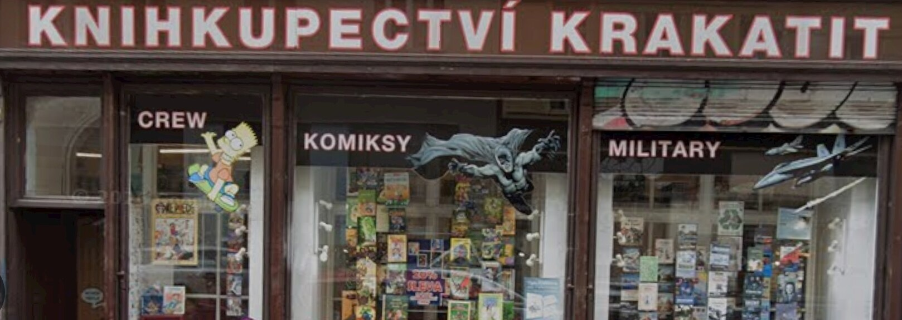
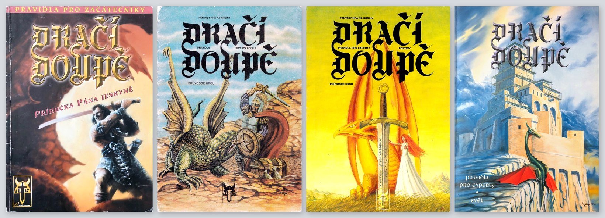

  Foto: Carol M. Highsmith / archiv Carol M. Highsmith, Kongresová knihovna, oddělení tisků a fotografií. <a href="https://www.loc.gov/pictures/item/2011632531/">loc.gov</a>

Bydleli jsme na Jarově, blízko centra. Na tyhle procházky s kočárkem jsme chodili hodně. Vždycky po škole, v dny, kdy jsem neměl hodinu houslí. Do centra jsme došli pěšky a zpátky jeli tramvají. Mamka, já a brácha, kterému bylo šest měsíců. Krásný den, slunečno a teplo.

Zastavili jsme u [Knihkupectví Krakatit][krakatit] kousek od Myslíkovy. Já šel dovnitř pro [Dračí doupě][drd]. Mamka zůstala venku s kočárkem.

  Knihkupectví Krakatit na Jungmannově (<a href="https://maps.app.goo.gl/WSsgbpe6RHvnsMhe8">Street view z května 2009</a>)

Doma už jsem měl **Pravidla pro pokročilé 1.3**. Koupil jsem je jen zázrakem — v antikvariátu u babičky na Hájích. Chyběly mi **Pravidla pro začátečníky 1.6** a oba díly pro experty: **Postavy** i **Svět**. Bez nich to nebyl komplet a já chtěl mít komplet, abychom si s kamarádama mohli hrát. DrD jsme tehdy hráli vedle [Magiců](/2024/01/15-stary-hrac-v-novem-svete/) — s těma jsem začal o rok dřív, na Pavlových narozeninách.

Altar už ho nevyvíjí. Mladší čtenáři možná dračák neznají: díru po něm vyplnily hlavně dvě nezávislé hry. [Dračí hlídka][hlidka] (2020) drží náladu klasického 1.6. [Jeskyně a draci][jad] (2021) jedou na D&D 5e. Altar mezitím vydal i Plus a DrD II, ale u stolů se uchytily tyhle dvě.

Bylo mi deset a kapesné jsem měl omezené. Koupit začátečníky a oba experty najednou bylo dost velké rozhodnutí. Byli jsme tam několikrát, než jsem se k nákupu odhodlal.

  Dračí doupě: začátečníci, pokročilí, experti (postavy) a experti (svět)

Koupil jsem je. Vyšel jsem z obchodu, pyšný, s taškou v ruce. A mamka mi to řekla.

Byla v šoku. Telefon neměla v kapse — držela ho v ruce. Nokia 5110, jako skoro každej. Pořád někdo volal. SMS pípala furt. Žádný internet, jen hovory a esemesky. Volala babičce. Volala Martinovi.

"Musíme jít domů," řekla mamka.

Tak jsme šli. Já s Dračím doupětem pod paží, mamka s kočárkem, a já ještě pořádně nechápal, proč se procházka musí zrušit.

Doma už to Martin pustil v televizi. Řekl, že do dvojčat narazila dvě letadla. Jako by jedno nestačilo. Pouštěli to pořád dokola. Nemohli jsme uvěřit, že je to doopravdy.

Večer jsme zkoušeli volat tetě do Dallasu. Babička volala sestře do Vancouveru. Všichni z toho byli vedle.

Zpětně mi dochází, že rodiče z toho museli mít pocit, jako by začínala třetí světová. Demokracie a svoboda u nich měly teprve dvanáct let.

Druhý den jsme ve škole nemluvili o ničem jiném. I když jsme byli jen malý děti. Měli jsme minutu ticha, ve stoje.

Bylo úterý 11. září 2001. Bylo mi deset.

Je to pětadvacet let.

[drd]: https://altar.cz/drd/about.html
[hlidka]: https://www.dracihlidka.cz/
[jad]: https://www.jeskyneadraci.cz/
[krakatit]: https://www.krakatit.cz/
