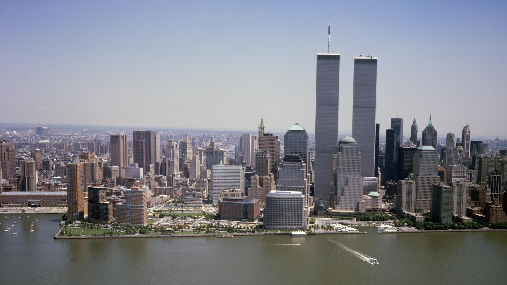

  Photo by Carol M. Highsmith / Carol M. Highsmith Archive, Library of Congress, Prints and Photographs Division. <a href="https://www.loc.gov/pictures/item/2011632531/">loc.gov</a>

25 let. Žádný slavnostní proslov. Chci si jen zapsat, co si z toho dne pamatuju — a co z něj cítím teď.

11. září 2001 bylo úterý. Bylo mi jedenáct a ještě jsem chodil na základku. V New Yorku začínalo ráno, u nás odpoledne. Já byl doma. Nejdřív jsem vůbec nechápal, na co se to všichni dívají.

Na televizi běžely dokola dvě věže. Jedna hořela. Pak i druhá. Pak se jedna zřítila, jako by to nebyla budova, ale něco, co se dá smazat z obrazovky. Pak druhá. A znova. A znova. Komentátoři říkali slova, kterým jsem rozuměl jen napůl — New York, letadla, teroristé. Já v tom hledal film. Nějakou katastrofu, která se omylem pustila odpoledne.

Něco ve mně ale vědělo, že to film není. Rodiče u televize neseděli tak, jak se sedí u filmu. Nekecali přes to. Neodcházeli uvařit čaj. Jen koukali.

Co jsem ten den dělal? Skoro totéž co každý jiný den. Ráno škola, odpoledne doma, večer pořád ta televize. Navečer už jsem věděl, že se stalo něco, po čem svět nebude stejný — i když jsem na to ještě neměl slova. Šel jsem spát s tím, že ty věže pořád padají. A že zítra zase bude škola.

O 25 let později bydlím ve Švýcarsku a mám dceru. Vím, kolik lidí ten den nepřišlo večer domů. Vím, co jsem tehdy nevěděl. Pořád ale, když tu siluetu uvidím, jsem na chvíli zase jedenáctiletý kluk, který zírá do televize a čeká, až to někdo vypne.

Nevypnuli. A já to nezapomněl.
